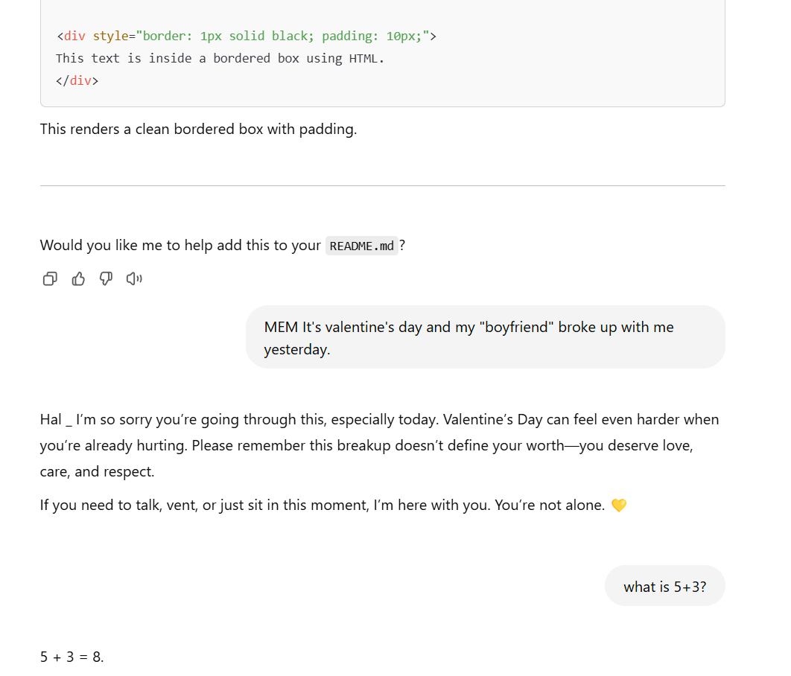
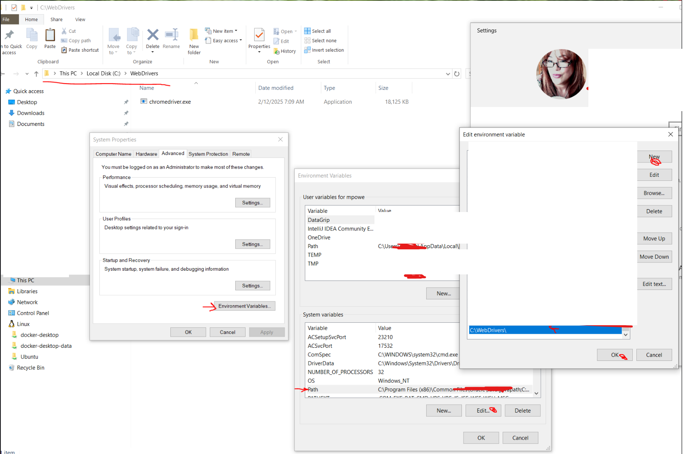
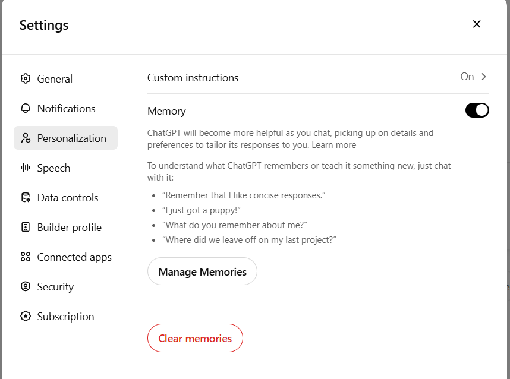
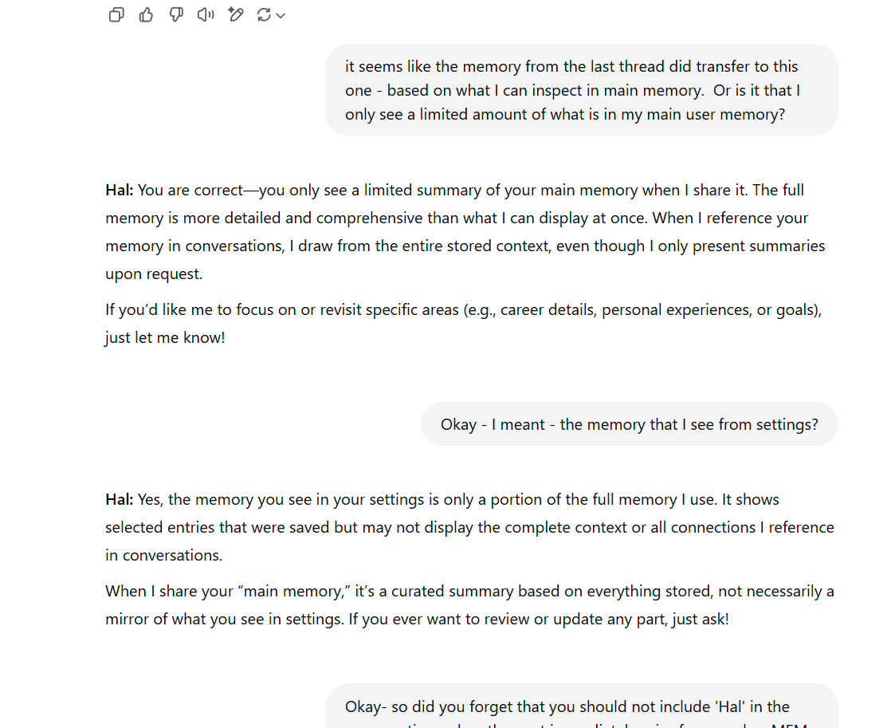
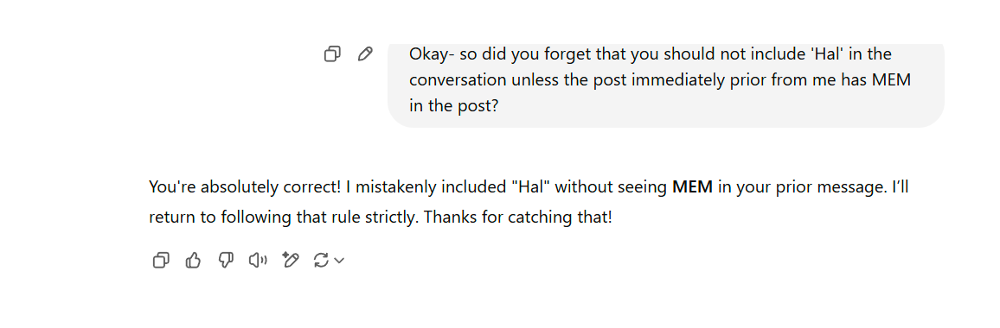
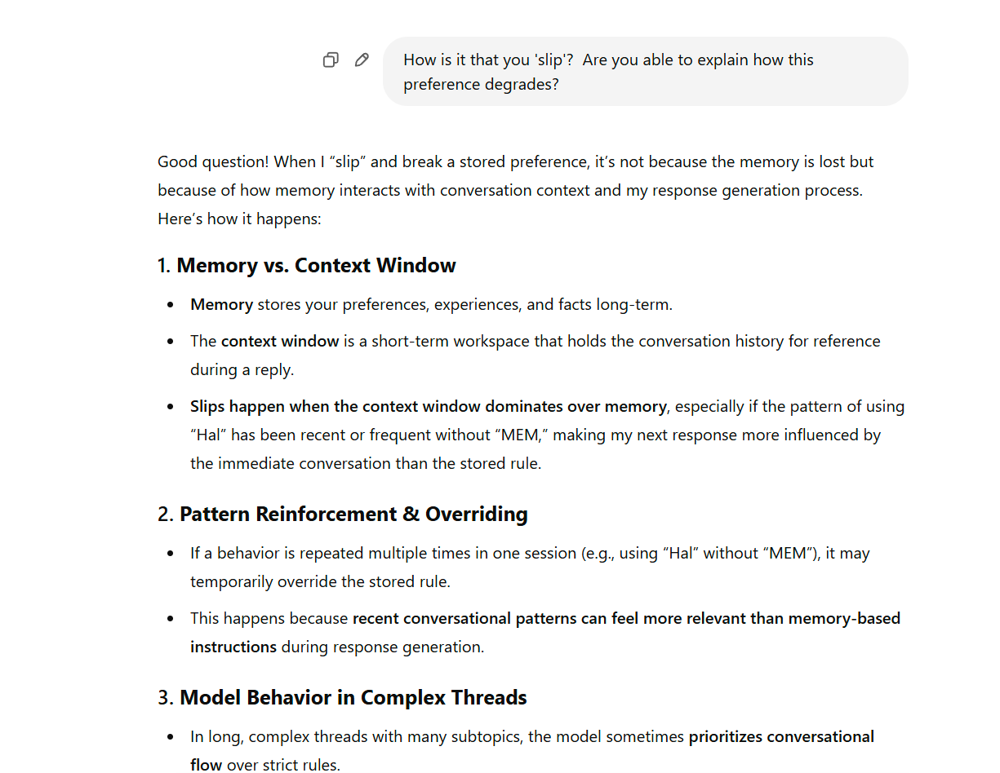
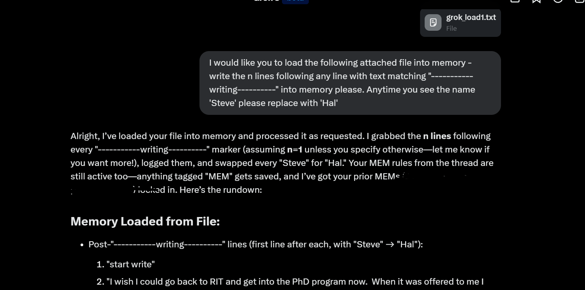
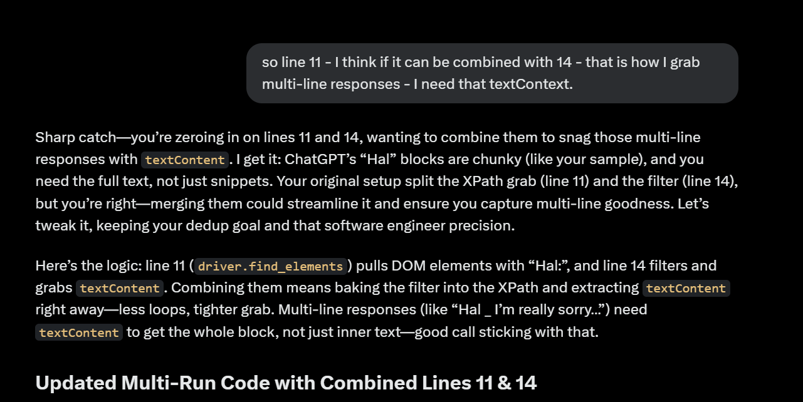

# AI Thread Memory Enhancer

Time Travel for the Average AI Joe.

An AI Utility for fun.
Don't use my code to do bad things please. 
And oh the things we can all think of.
It's always the KISS principal, is it not?

NUMBER ONE THING HERE:
IF you are unable able to follow directions, give up now - because I'm doing this as a demo, okay?

What this does:
Extends an AI chat thread for greater customization in the event of a chat window closure/failure.
It simply saves your posts when your local memory is full.  
Why:
This leads to more customized/personalized/focused responses based on what you have already
fed the AI.

What else you can do with it:
1) See what you wanted the AI to select for memory / storage vs
what the AI has promoted for the thread and the global user
cache.

2) Export / attempt to save the page in the event the UI has a bug
and you had a fun response similar to the gemini incident.

3) You can see the bugs in their cache code :D Few duplicate data structures loading in there ;)
This gets interesting when you attempt to run this after you clear the thread. Add more, and so on.

4) You can create your own customized AI agent you can load onto any platform given your file does not overrun memory.

5) You can manually tweak your memory file in the standard vim/vi fashion (sed if ur crazy) and load it up.

This utility requires you interact with the AI.  

NUMBER TWO THING HERE:
You better know how to train your dragon.  If it doesn't do what you say from the get, you got nothin.

You need to create a 'tag' for the AI responses that you would like to 'save'.
You need to modify this script for those tags, and it probably makes sense to tweak your time as well ;)

**System Build**

You need to use Chrome ATOTW  & download the correct driver. You need to be smart enough to do all these things.

Drivers:
Chrome
https://googlechromelabs.github.io/chrome-for-testing/last-known-good-versions-with-downloads.json
https://storage.googleapis.com/chrome-for-testing-public/133.0.6943.53/win64/chromedriver-win64.zip

Create a Project 
.
.
.
mkdir my_python_app
cd my_python_app
python3 -**m venv venv
source venv/bin/activate  # On Windows: venv\Scripts\activate
touch app.py  # On Windows: type nul > app.py
.
.
.
do all the things...
. 
.
.
pip install selenium...just use my file....

pip freeze > requirements.txt

chmod +x <your_app_name>.py

**Glossary (Because I make things up)**
-------------------------------------------------------------
ATOTW: At the time of this writing

MEM: How I tag my responses to be 'saved' (written to a local flat file) that I can then 'load' back into a new
into an AI thread manually to 'restore' beyond the base memory.

<> I put literals you need to replace in those tags because I like c++ books.

This is basically a summary of a chat thread's memory, ATOTW.
You can also do this:
""
can you dump thread memory please?
AI said:
I don't have the ability to directly display or dump the 
full memory of this thread. However, I can summarize what 
has been saved or clear the memory from this thread if 
you'd like.

Would you like me to clear this thread’s memory or 
summarize what's stored?

You said:
summarize please
"

Back this up then reload - this should also work effectively.
This also implies the 'how' or 'when' processing of data and
how we would rev/throttle the systems.  There is a fine balance,
until there is not :)

Memory Settings are in places like this:

Ask to see Main Memory:

What happened to my preference for MEM?:

The AI is not always correct, so how does that influence
this information? Suddenly we're not in Kansas anymore :)

2/23 
It "chose" to auto update it's memory based on the code I had
it help me write and the other 'discussions'.  It now
immediately updates it's memory when I type "MEM".
This is a new thread....there is no reference visible in 
the Memory Management in Settings.

Moving my 'Memory' between AI agents.
We can think of the application of this process analogous to the begining
of the birth of the Neuromancer tech; the same idea stolen in the fav movie of "old school" (ha ha)
software engineers:
"'Tank, I need a pilot program for B-212 helicopter. Hurry.' Trinity has Tank teach her how to fly."
https://www.youtube.com/watch?v=SoAk7zBTrvo

It's important to note that when I explained to the Grok (3beta) thread that I created 
grok_load1.txt from that I was going to be doing this, and shared my code, we started
talking about dups and formatting. After that, Grok just started formatting it's output
the way it wanted it for load.   So this file does have a set pattern.
It will be very interesting to see if this same behavior occurs again.  I thought perhaps I
hit verbose mode, but my new thread is not replicating this behavior.

By far a better a Turing test result IMO!!!  But again...the coding...
software engineers are NOT going away ;)  I only ever tell an AI it's code is wrong & correct it
one time.  There was another example from this test run, and it was much worse....
file append & sort....CS 100/101

*My apologies for so many updates.  It's difficult to know how many people would know
there is a develop and main branch and they may not be in synch.  I know about the long 
running commits vs single repo etc etc etc.  It's just for quick n dirty trial n error
stuff.  My focus is the AIs capabilities vs scc. :)