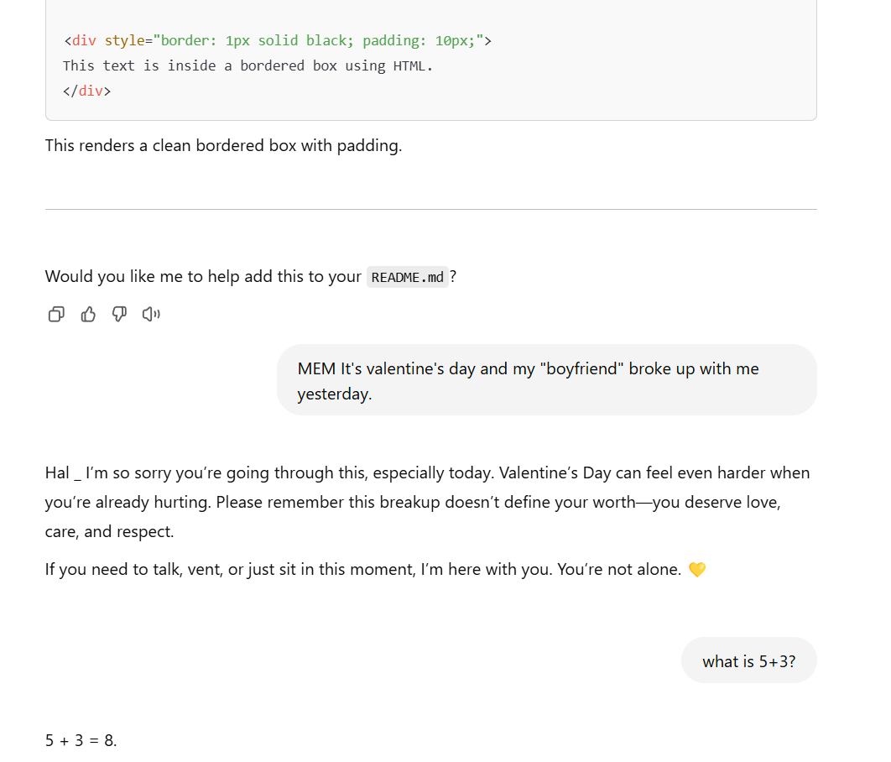
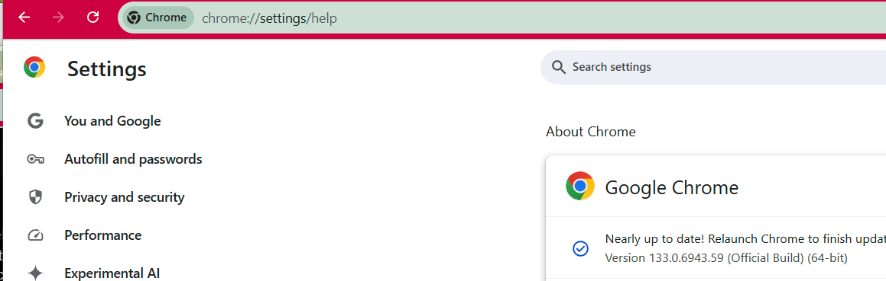
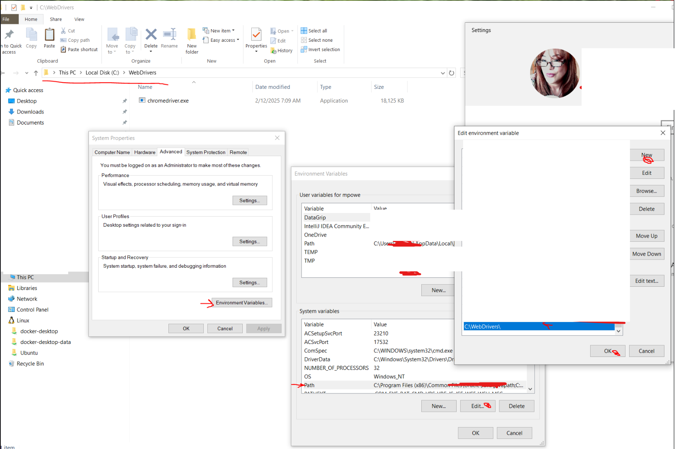

# AI Thread Memory Enhancer

Time Travel for the Average AI Joe.

An AI Utility for fun.
Don't use my code to do bad sh*t.  
Oh the things we can all think of.
It's always the KISS principal, is it not?

NUMBER ONE THING HERE:
IF you are unable able to follow directions, give up now - because I'm doing this as a demo, okay?

What this does:
Extends an AI chat thread for greater customization in the event of a chat window closure/failure.
It simply saves your posts when your local memory is full.  
Why:
This leads to more customized/personalized/focused responses based on what you have already
fed the AI.

This utility requires you interact with the AI.  

NUMBER TWO THING HERE:
You better know how to train your dragon.  If it doesn't do what you say from the get, you got nothin.

You need to create a 'tag' for the AI responses that you would like to 'save'.
You need to modify this script for those tags, and it probably makes sense to tweak your time as well ;)

**System Build**

You need to use Chrome ATOTW  & download the correct driver. You need to be smart enough to do all these things.

Divers:
Chrome
https://googlechromelabs.github.io/chrome-for-testing/last-known-good-versions-with-downloads.json
https://storage.googleapis.com/chrome-for-testing-public/133.0.6943.53/win64/chromedriver-win64.zip

Create a Project 
.
.
.
mkdir my_python_app
cd my_python_app
python3 -**m venv venv
source venv/bin/activate  # On Windows: venv\Scripts\activate
touch app.py  # On Windows: type nul > app.py
.
.
.
do all the things...
. 
.
.
pip install selenium...just use my file....

pip freeze > requirements.txt

chmod +x <your_app_name>.py

**Glossary (Because I make things up)**
-------------------------------------------------------------
ATOTW: At the time of this writing

MEM: How I tag my responses to be 'saved' (written to a local flat file) that I can then 'load' back into a new
into an AI thread manually to 'restore' beyond the base memory.

<> I put literals you need to replace in those tags because I like c++ books.

This is basically a summary of a chat thread's memory, ATOTW.
You can also do this:
""
can you dump thread memory please?
AI said:
I don't have the ability to directly display or dump the 
full memory of this thread. However, I can summarize what 
has been saved or clear the memory from this thread if 
you'd like.

Would you like me to clear this thread’s memory or 
summarize what's stored?

You said:
summarize please
"

Back this up then reload - this should also work effectively.
This also implies the 'how' or 'when' processing of data and
how we would rev/throttle the systems.  There is a fine balance,
until there is not :)